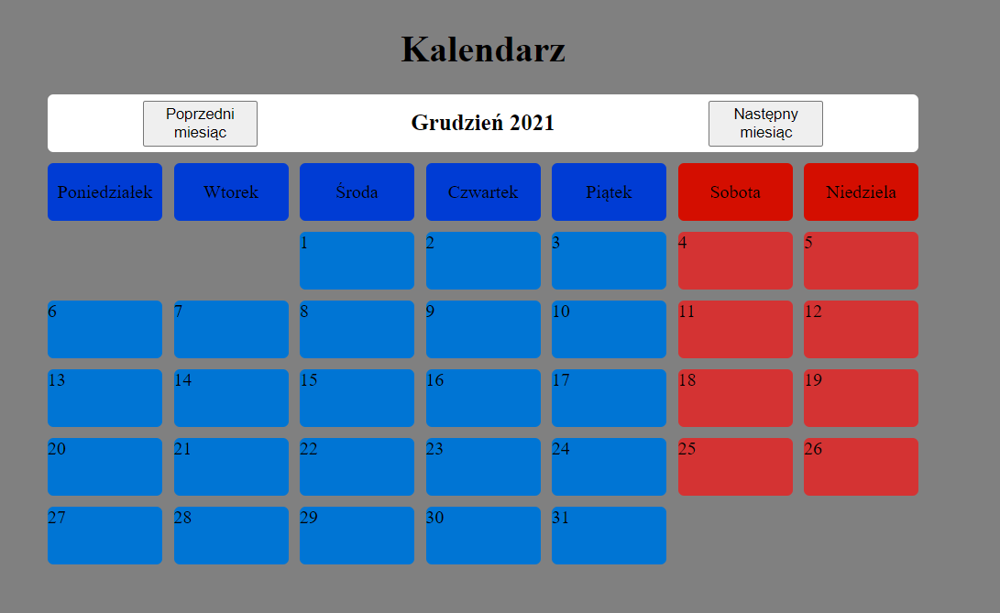
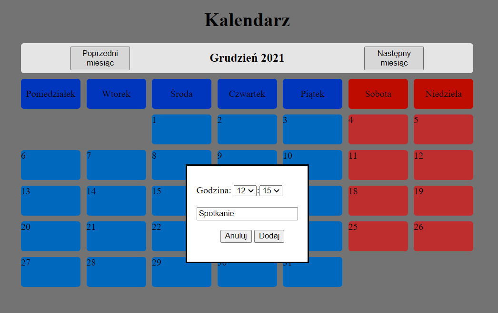
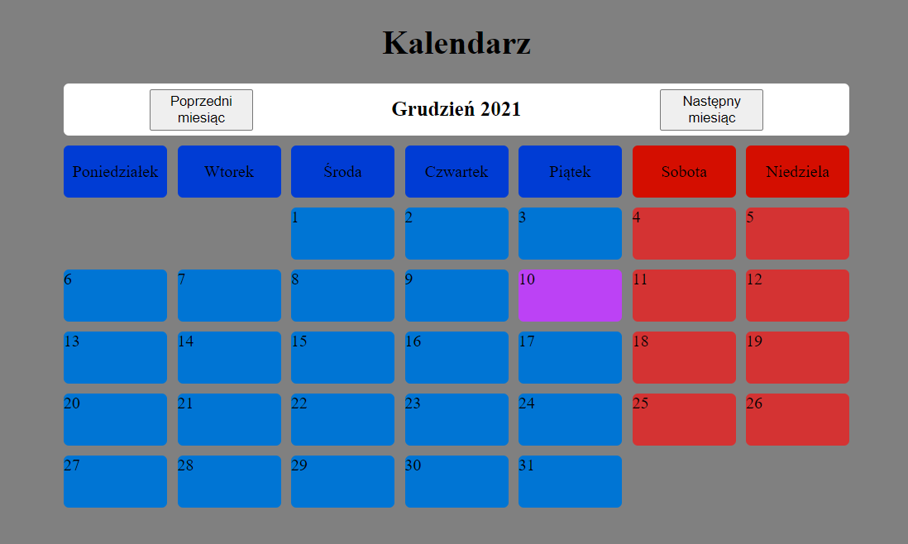

# Kalendarz

## Table of contents
* [General info](#general-info)
* [Technologies](#technologies)
* [Features](#features)
* [Screenshots](#screenshots)

## General info
This is simple calendar based on localStorage.
	
## Technologies
Project is created with:
* JavaScript
* CSS3
* HTML5

## Features
* Change months using buttons
* Save events on localStorage
* Delete events from localStorage

## Screenshots
#### User Interface

#### Adding event

#### After adding event

